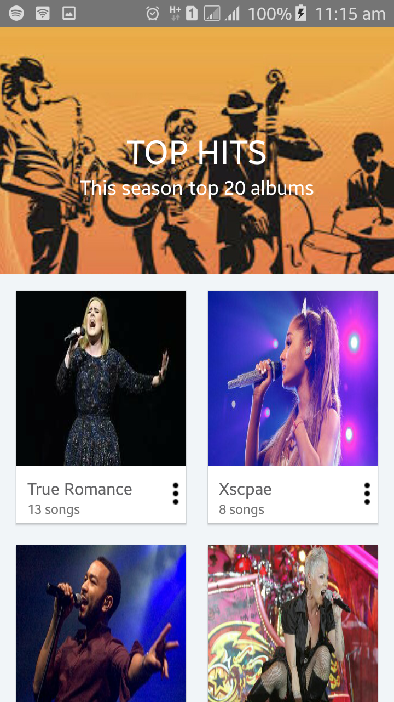

# MusicaGallery.

#### A music app  , Sunday 22th September 2019
##### By **Davis Wafula**;
## Description

Simple music gallery app

## ScreenShots

                            

## Disclaimer!!

Still under construction
Test for android cardview

## Project setup instructions
* installations such as JUnit, intellij, SDK, JDK, Android Studio.

* Clone the project into your machine.

* Run App to compile the program

## Technologies used
* Java.

*Android.

### Installation
1. Clone the repo `https://github.com/Davisdavy/MyMusica.git`
2. CD into the folder `cd MyMusica`

## Licence

MIT License

Copyright (c) [2019] [Davis Wafula]